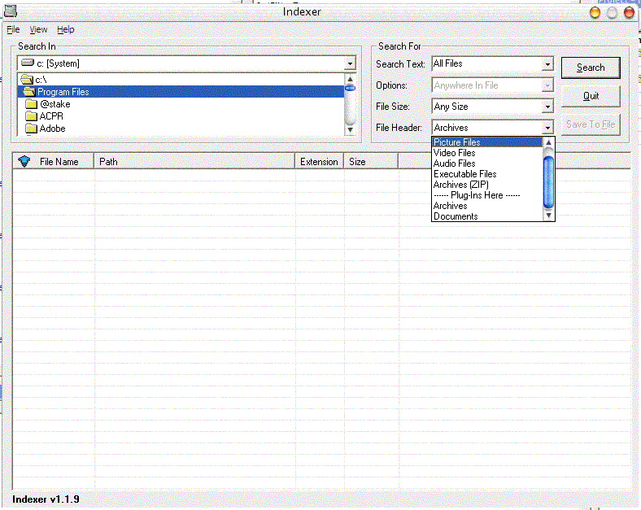



## Indexer  \[ 27\-12\-2003\]

### Description

Just A Updated of my last version as someone asked me for external database for filetypes in this version i tried my hands on plugins capability in this unique application which lets you add your own plugins for adding more file types scan capability the plugin engine is developed by me itself and is at very first stage. so any comment and bug report is invited plz vote for this code and also try to help by creating your own plugins and if you find them working plz send them to me to add them officially to this application.
 
### More Info
 

             |
---                |---
**Submitted On**   |2003-12-24 23:33:02
**By**             |[V2](https://github.com/Planet-Source-Code/PSCIndex/blob/master/ByAuthor/v2.md)
**Level**          |Intermediate
**User Rating**    |4.5 (18 globes from 4 users)
**Compatibility**  |VB 6\.0
**Category**       |[Files/ File Controls/ Input/ Output](https://github.com/Planet-Source-Code/PSCIndex/blob/master/ByCategory/files-file-controls-input-output__1-3.md)
**World**          |[Visual Basic](https://github.com/Planet-Source-Code/PSCIndex/blob/master/ByWorld/visual-basic.md)
**Archive File**   |[Indexer\_\_\[16872012272003\.zip](https://github.com/Planet-Source-Code/v2-indexer-27-12-2003__1-50631/archive/master.zip)

